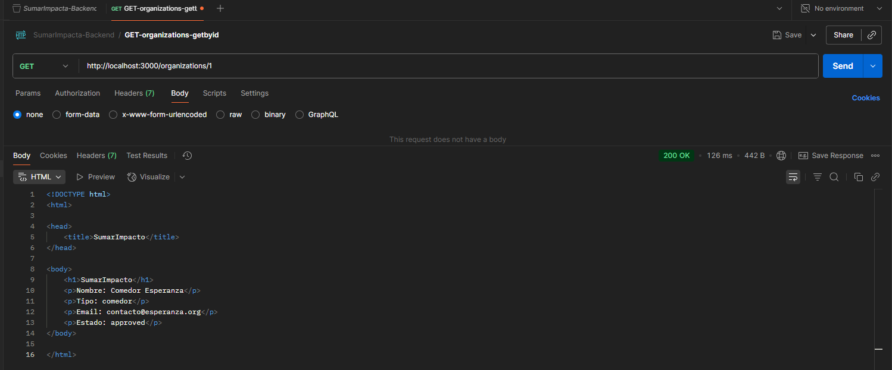

# SumarImpacto Backend - Grupo 17

Proyecto académico desarrollado para la materia **Desarrollo de Sistemas Web Back End**  
del **IFTS N° 29 - 2do Cuatrimestre 2026**.

## Sobre el proyecto

**SumarImpacto** es una asociación civil sin fines de lucro orientada a vincular
organizaciones sociales con donantes interesados en financiar proyectos de impacto social.

El sistema busca facilitar la gestión de campañas, fondos y rendiciones, haciendo
especial énfasis en la **trazabilidad y transparencia del uso de los recursos**.

## Objetivo

Desarrollar el backend del sistema mediante una **API REST**, aplicando los conceptos
trabajados durante la cursada.

Inicialmente la persistencia de datos se realizará utilizando archivos **JSON** y,
posteriormente, se incorporará **MongoDB**.

## Estado actual

Actualmente se encuentra implementada la base inicial del backend. Este es un
estado parcial correspondiente a la **Etapa 1** del proyecto y no representa la
documentación final del sistema.

Lo implementado hasta el momento incluye:

- Node.js
- Express
- arquitectura MVC
- persistencia en archivos JSON
- Pug como motor de vistas
- ruta `GET /organizations/:id`

La siguiente captura corresponde a una prueba realizada con Postman sobre el
endpoint `GET /organizations/1`, cuya respuesta fue `HTTP 200 OK`.

<p align="center">
  
</p>

<p align="center">
  <em>Prueba exitosa del endpoint GET /organizations/1 utilizando Postman.</em>
</p>

Casos actualmente verificados:

- GET /organizations/1 → 200 OK
- GET /organizations/999 → 404 Not Found
- GET /organizations/abc → 400 Bad Request
- GET /organizations/0 → 400 Bad Request

## Tecnologías

- JavaScript
- Node.js
- Express
- JSON
- MongoDB *(más adelante durante la cursada)*

## Cómo ejecutar el proyecto

1. Instalar las dependencias:

```bash
npm install
```

2. Levantar el servidor en modo desarrollo:

```bash
npm run dev
```

Este comando ejecuta `nodemon index.js`, por lo que el servidor se reinicia automáticamente cuando se modifican archivos.

También puede ejecutarse sin Nodemon:

```bash
npm start
```

que ejecuta directamente:

```bash
node index.js
```

Una vez iniciado el servidor, el endpoint actualmente disponible puede probarse desde el navegador o Postman:

```text
http://localhost:3000/organizations/1
```

O desde la terminal:

```bash
curl -i http://localhost:3000/organizations/1
```

Los comandos `npm start` y `npm run dev` están definidos en la sección `scripts` de `package.json`.

## Grupo

**Grupo 17 - Desarrollo de Sistemas Web Back End**

## Estado

🚧 Proyecto en desarrollo.